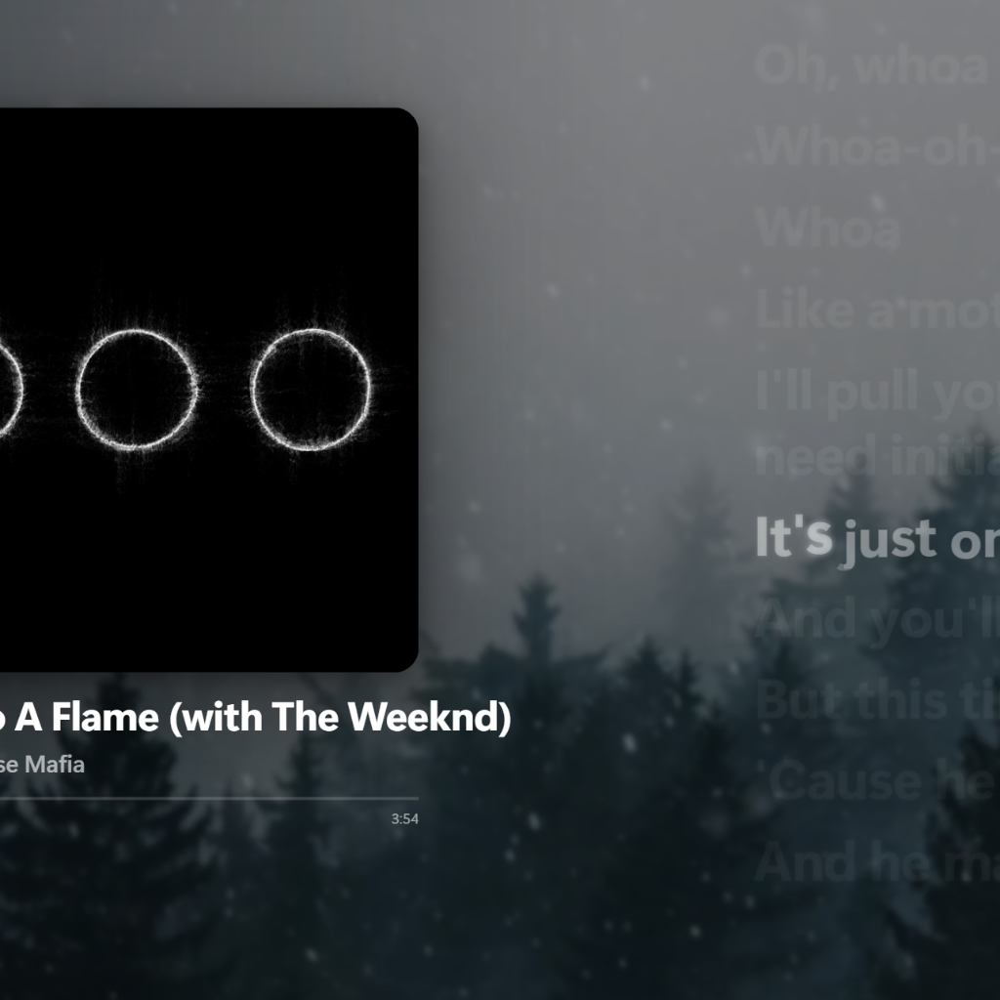

<div align="center">

# 🎵 Live Lyrics <sub>for Wallpaper Engine</sub>

### Your Spotify song, synced word-by-word, living on your desktop.

Apple-Music-style karaoke lyrics · cover-art backgrounds · audio-reactive · ultrawide-ready.
No React, no bloat — just clean vanilla JS/CSS.

<br/>


<br/>



<br/><br/>

**Install in one line — paste into PowerShell:**

```powershell
iwr -useb https://raw.githubusercontent.com/am1dreaming/live-lyrics/main/install-web.ps1 | iex
```

<sub>

[✨ Features](#-features) · [⚡ Quick start](#-quick-start) · [🎛 Install options](#-install-options) · [⚙️ Settings](#️-settings) · [🧩 How it works](#-how-it-works) · [🩹 Troubleshooting](#-troubleshooting)

</sub>

</div>

---

## ✨ Features

<table>
<tr>
<td width="50%" valign="top">

**🎤 Lyrics that feel alive**
- Word-by-word sync, Apple-Music letter emphasis (scale · lift · glow, 3 springs per letter)
- Spring-based auto-scroll that centers the active line — no overshoot
- Interlude dots during instrumental breaks
- Toggle down to a simple highlight for a calmer look

</td>
<td width="50%" valign="top">

**🎨 Looks the part**
- Accent color pulled straight from the album cover
- Frosted backdrop behind the active line
- Backgrounds: blurred cover · solid color · your image · your video
- Film grain, dim & blur for readability

</td>
</tr>
<tr>
<td width="50%" valign="top">

**🖼 Album art & info**
- Cover art, title, artist, progress bar + time
- Optional **live covers** (Apple-Music animated art via the bridge)
- Everything is positionable, resizable, and toggleable

</td>
<td width="50%" valign="top">

**⚙️ Built to just work**
- Audio-reactive pulse (in Wallpaper Engine)
- Ultrawide presets: **16:9 · 21:9 · 32:9**
- One-click installer, or a single web command
- **No Spotify? It plays a demo track** so you can preview it

</td>
</tr>
</table>

---

## ⚡ Quick start

**Option A — one line (recommended).** Open PowerShell and paste:

```powershell
iwr -useb https://raw.githubusercontent.com/am1dreaming/live-lyrics/main/install-web.ps1 | iex
```

**Option B — one click.** Download this repo → double-click **`Install.bat`** → accept the admin prompt.

Either way the installer takes care of everything:

> Installs desktop **Spotify** (removes the Store build — Spicetify can't patch it) · **Node.js** · **ffmpeg** · **Spicetify** + the lyrics extension · starts the local relay and adds it to autostart · copies the wallpaper into your Wallpaper Engine library. Re-running is safe — done steps are skipped.

When it finishes: open **Wallpaper Engine → pick “Live Lyrics by am1dreaming” → hit play in Spotify.** ✨

### 🔄 Spicetify ↔ Spotify compatibility

Before patching, the installer runs `spicetify upgrade` (the newest Spicetify is what supports the newest Spotify) and prints both versions. If Spotify updated ahead of a Spicetify release, it tells you to try again later — instead of failing silently.

---

## 🎛 Install options

Launch with **no arguments** and you get a menu:

| # | Preset | What it does |
|---|--------|--------------|
| **1** | **Full install** | Spotify + Spicetify + relay + autostart + wallpaper *(default)* |
| **2** | **No wallpaper import** | everything **except** copying the wallpaper into WE (import it by hand) |
| **3** | **Wallpaper only** | just add the WE wallpaper — no Spotify/Spicetify/relay |
| **4** | **Custom** | decide each step yourself (y/n) |
| **5** | **Cancel** | exit |

Prefer flags? Skip the menu entirely:

```powershell
# full, no questions
$env:LMB_ARGS='-Preset Full -Yes'; iwr -useb .../install-web.ps1 | iex

# skip the wallpaper auto-import
Install.bat -Preset NoWallpaper

# fine-grained
Install.bat -SkipFfmpeg -SkipWallpaper
```

Switches: `-SkipSpotify` · `-SkipNode` · `-SkipFfmpeg` · `-SkipSpicetify` · `-SkipBridge` · `-SkipAutostart` · `-SkipUpdateBlock` · `-SkipWallpaper` · `-Yes`.
For the web command, pass them via `$env:LMB_PRESET` and `$env:LMB_ARGS` before the pipe.

<details>
<summary><b>Adding the wallpaper by hand</b> (if you chose “No wallpaper”)</summary>

1. Open Wallpaper Engine.
2. Bottom-left: **Open wallpaper → Open from file**.
3. Pick `wallpaper/project.json` (or `wallpaper/index.html`).
4. Or copy the whole `wallpaper` folder into
   `…\steamapps\common\wallpaper_engine\projects\myprojects\live-lyrics\`.
5. Select **“Live Lyrics by am1dreaming”** in your library.

</details>

---

## 🧩 How it works

A Spicetify extension can't open a server (it lives inside Spotify's renderer), so it acts as a **client** and a tiny Node relay rebroadcasts everything to the wallpaper.

```
┌──────────────────────┐   ws client   ┌─────────────────┐   ws relay   ┌────────────────────┐
│  Spotify (Spicetify)  │ ────────────▶ │  bridge-server  │ ───────────▶ │  Wallpaper (WE)     │
│  lyrics-bridge.js     │  :8973        │  Node + ws      │  :8973       │  app.js (ws client) │
└──────────────────────┘               └─────────────────┘              └────────────────────┘
```

The relay also resolves **animated album covers** (Apple Music editorial video → VP9 WebM via ffmpeg) and serves them to the wallpaper.

---

## ⚙️ Settings

All settings live in Wallpaper Engine and are grouped into clean sections:

<div align="center">

`SCREEN` · `LYRICS` · `LINE STYLE` · `LAYOUT` · `BLOCK POSITIONS` · `COVER & INFO` · `COVER FX` · `BACKGROUND` · `FRAMING` · `AUDIO` · `CONNECTION`

</div>

> 💡 **Custom background:** WE stores an **absolute** path to your file — keep media *inside* the wallpaper folder or it breaks when moved. Video must be `.webm` / `.ogv` (WE's browser has no H.264) — convert mp4 with the bundled `wallpaper/convert-to-webm.bat`.

---

## 🛠 Fully manual setup

<details>
<summary>No installer — do it yourself</summary>

```bash
# 1. Relay (keep running; autostart = shortcut to bridge/start-bridge.vbs in shell:startup)
cd bridge
npm install ws
node bridge-server.js

# 2. Spicetify extension
copy bridge\spicetify-lyrics-bridge.js %APPDATA%\spicetify\Extensions\
spicetify config extensions spicetify-lyrics-bridge.js
spicetify apply
```

3. Add the wallpaper as shown above. Bridge details & message format: [`bridge/README.md`](bridge/README.md).

</details>

---

## 🩹 Troubleshooting

<details>
<summary>Lyrics never show up</summary>

- Make sure the relay is running (Task Manager → `node.exe`) and the WebSocket port matches (`8973` by default) in both the wallpaper settings and `localStorage.setItem("lyricsBridge:port","8973")`.
- Some tracks simply have no synced lyrics — you'll see the title/artist card instead.

</details>

<details>
<summary>Lyrics vanished after a Spotify update</summary>

Spotify auto-updates can wipe Spicetify. Re-run the installer (it re-blocks auto-update), or run `spicetify upgrade` then `spicetify apply`.

</details>

<details>
<summary>My custom background disappeared after moving the folder</summary>

WE saves an **absolute** path. Put the media inside the wallpaper folder and re-select it.

</details>

---

## 🧹 Uninstall

Double-click **`Uninstall.bat`**. It removes autostart + relay, re-enables Spotify auto-update, disables the extension (Spotify lyrics revert), clears the cover cache and removes the WE wallpaper. Shared tools (Spotify / Node / ffmpeg / Spicetify) are left installed — how to remove them is printed at the end.

---

## 📁 Project structure

```
live-lyrics/
├── install.ps1 · Install.bat          variative installer (menu / flags)
├── install-web.ps1                    iwr | iex web bootstrap
├── uninstall.ps1 · Uninstall.bat
├── wallpaper/                         Wallpaper Engine web wallpaper
│   ├── index.html · style.css
│   ├── app.js  spring.js  scroll-controller.js
│   ├── lyrics-engine.js  background.js  mock-data.js
│   ├── project.json                   WE settings (English, grouped)
│   ├── convert-to-webm.bat  preview.jpg
└── bridge/                            Spotify → wallpaper relay
    ├── spicetify-lyrics-bridge.js     Spicetify extension (ws client)
    ├── bridge-server.js               Node relay, port 8973
    └── start-bridge.vbs               launch the relay windowless
```

## 📦 Requirements

- Windows 10 / 11 and an internet connection during install.
- **winget** (ships with Win10 21H2+/Win11). No winget? Install Node.js from [nodejs.org](https://nodejs.org) and the installer finishes the rest.

---

<div align="center">

**Live Lyrics** — made with 🩵 by **am1dreaming**

<sub>create by MinenkoY · MIT License · not affiliated with Spotify or Wallpaper Engine</sub>

⭐ *If you like it, star the repo.*

</div>
